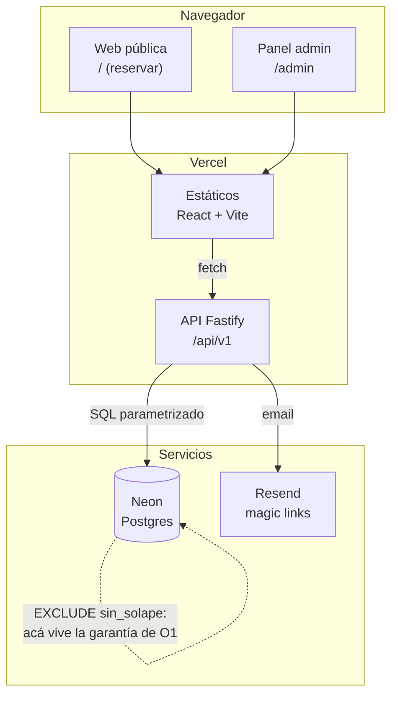
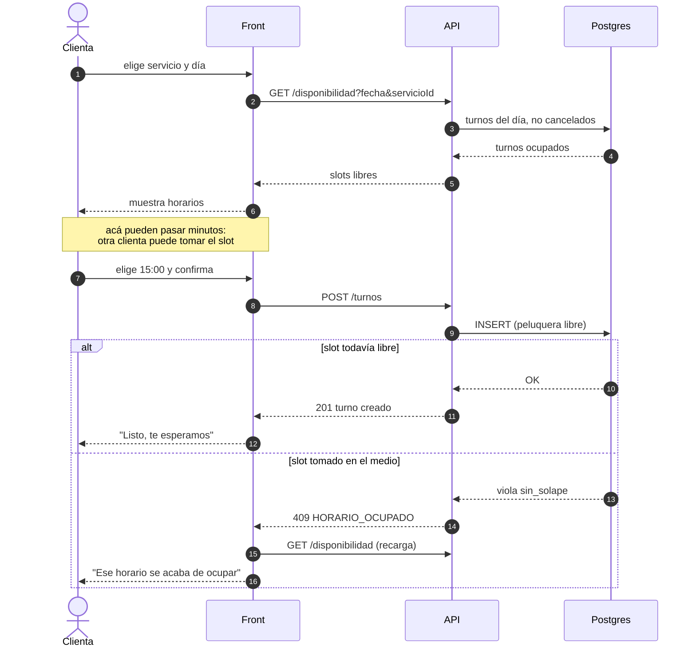
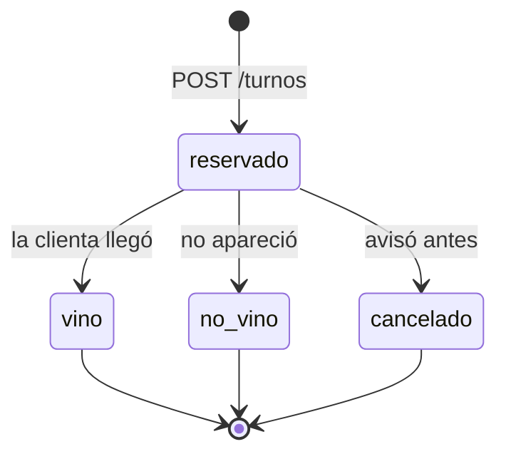

# diagram.md · Turnos

**Versión:** 0.3.0 · Diagramas en Mermaid: se versionan como texto y se diffean en el PR, a diferencia de una captura.

## Arquitectura

## Flujo de reserva (el camino crítico)

La rama del `else` es el motivo por el que el diagrama existe: es el caso que se olvida al diseñar y el que más se ve en producción.

## Estados de un turno

No hay transición hacia atrás y **no hay `DELETE`**: `no_vino` es el dato que alimenta O3, y un turno borrado es un dato perdido para siempre.
