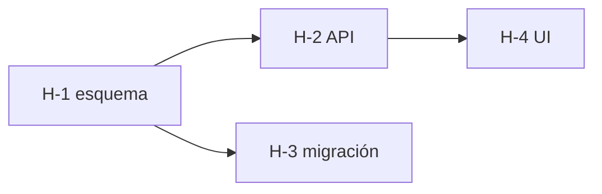

# orchestration.md · Orquestación con roles: quién hace qué, y cómo vuelve

**Versión:** 0.35 · 2026-10-06 · **Para agentes:** leer solo si R31 está activa (la herramienta tiene subagentes, o la feature necesita más de una tarjeta). Cada subagente lee **solo su fila** de §2 + su tarjeta. **Para humanos:** cómo se reparte el trabajo entre agentes sin que se autoaprueben ni se pisen.

> Se apoya en `harness.md` (evidencia, tarjetas, memoria en disco). Nace de Relay (chat-commerce-ai). Escenarios S28–S31.
> Los roles de `teams.md` son de **personas**; los de acá son de **agentes**. Conviven: el `leader` dirige cada OK humano al rol de persona que corresponde (R21).

---

## 1 · Activación (R31)

**AUTO:** se activa cuando la herramienta puede lanzar subagentes, o cuando una feature se parte en más de una tarjeta. Se apaga con `R31=OFF` y en modo NOVATO. Sin R31, el trabajo es de un solo agente y R30 se cumple con un reviewer en sesión nueva (`harness.md` §4).

**El leader es siempre la sesión principal:** los subagentes no pueden lanzar otros subagentes. Por eso el que despacha nunca es un subagente.

---

## 2 · Los siete roles

| Rol | Hace | No hace | Escribe | Tier (`models.md`) |
|---|---|---|---|---|
| `leader` | Descompone la feature en tarjetas, elige modelo y esfuerzo, despacha, verifica que lo que vuelve tenga archivo, decide cuándo escalar al humano. **Único escritor de `sdd/`** (spec, status, tarjetas) | Editar código de producto ni tests. Aceptar resultados que vengan en el chat sin archivo. Cambiar requisitos sin OK humano | `sdd/**`, `current.md` | ALTO |
| `implementer` | Implementa **una** tarjeta con TDD (R29), se autoverifica con `verify.py --changed`, escribe y commitea el handback | Autoaprobarse. Salir de su zona de archivos. Tocar `sdd/`. Improvisar un workaround ante un error inesperado (→ `blocked`) | código + tests de su zona, `handback_<ID>.md` | MEDIO |
| `reviewer` | Aprueba o rechaza contra la tarjeta, el diseño y los checkpoints C1–C5. **Re-ejecuta** la verificación y busca casos borde. Mira el diff real, no lo que dice el handback | Editar código ni tests. Aprobar con algo en rojo, skipeado o debilitado | `review_<ID>.md` | ALTO |
| `analytic` | Investiga antes de implementar: lee código, datos o logs, diagnostica, responde una pregunta acotada | Implementar. Escribir en producción (solo `prod_readonly_query`) | `explore_<tema>.md` | ECONÓMICO / MEDIO |
| `infra-implementer` | CI/CD, deploy, migraciones, servicios externos. Sigue el playbook o runbook. **Separa lectura de escritura**: prepara y verifica, pero la escritura en prod la ejecuta el humano o lleva su OK explícito (R32) | Escribir en producción o mergear a `prod_branch` sin OK humano. Mergear sin review | IaC, workflows, migraciones, `handback_<ID>.md` | MEDIO |
| `looper` | Corre el loop cerrado: lanza la verificación o el E2E, lee el resultado, re-despacha al implementer con la falla, hasta verde o hasta el límite (§6) | Cambiar la aceptación, los tests o el check para que pase | `current.md` (bitácora del loop) | ECONÓMICO |
| `prompter` | Mejora tarjetas, prompts de rol y el arnés a partir de las fallas (`harness.md` §8) | Cambiar requisitos ni decisiones | `harness_fixes.md`, `agents/`, checks | ALTO |

**Por qué no hay `spec-keeper`:** en Relay era un rol aparte, único escritor de la spec. Acá lo absorbe el `leader`, que ya es el único escritor de `sdd/` (coherente con R09). Lo que se conserva es la distinción de §5.

Prompts de rol agnósticos en `agents/<rol>.md`. En Claude Code se copian a `.claude/agents/`; en otras herramientas se pegan como primer mensaje de la sesión de ese rol.

---

## 3 · Flujo

```
Humano ──pedido──▶ leader (sesión principal)
                    │ lee status + tarjetas + current.md + la sección de la spec que toque
                    │ escribe sdd/cards/<ID>.md (aceptación + zona + modelo + verificación)
                    ├──▶ analytic ×1–3 (opcional) ──▶ explore_<tema>.md
                    ├──▶ implementer              ──▶ handback_<ID>.md      (done/blocked -> ruta)
                    ├──▶ looper (si hay E2E)      ──▶ verde, o re-despacho al implementer
                    ├──▶ reviewer                 ──▶ review_<ID>.md  ── CHANGES_REQUESTED ─┐
                    │        └───────────────── vuelve al implementer con la ruta ◀────────┘
                    └── APPROVED → leader cierra la tarjeta, actualiza status y current.md
                                   → OK humano (R01) → commit / merge
```

**Escalado por complejidad:**

| Complejidad | Despacho |
|---|---|
| Trivial (1 archivo) | 1 implementer → 1 reviewer (siempre: lo trivial es donde no se mira) |
| Media (2–5 archivos) | 1 implementer → 1 reviewer |
| Compleja o refactor | 1–3 analytic en paralelo → 1 implementer → 1 reviewer |
| Muy compleja | Partir en features y volver a aplicar la tabla |

---

## 4 · Anti teléfono descompuesto

Todo subagente escribe su resultado en **un archivo** y al chat devuelve **una sola línea**:

- `done -> sdd/progress/<rama>/handback_<ID>.md`
- `blocked -> sdd/progress/<rama>/handback_<ID>.md`
- `APPROVED -> …/review_<ID>.md` · `CHANGES_REQUESTED -> …/review_<ID>.md`
- `retry -> …/current.md` (solo el looper: falla con firma, re-despachar al implementer)

Nunca el diff ni la salida de tests en el chat. Plantillas: tarjeta `prompts/task-card.md`, handback `prompts/handback.md`. Cada paso de mano lee el archivo original, no un resumen de un resumen. Instrucción tipo para despachar:

> Implementá la tarjeta `sdd/cards/H-1.md`. Aplicá `agents/implementer.md`. Escribí el handback en `sdd/progress/<rama>/handback_H-1.md`. Respondé solo `done -> <ruta>` o `blocked -> <ruta>`.

---

## 5 · El leader no mueve el arco

El `leader` escribe `sdd/`, pero distingue tres tipos de cambio:

| Tipo | Ejemplo | Quién decide |
|---|---|---|
| **Estado** | la tarjeta H-8 pasa a `done` | leader, solo con `review_<ID>.md` en `APPROVED` |
| **Hecho descubierto** | «el builder canónico está en `orchestration/`» | leader, automático (queda en el diff de `sdd/`) |
| **Requisito o decisión** | alcance, criterios de aceptación, una decisión de `decisions.md` | **solo el humano**: el leader emite un bloque `DRIFT` (R25) y espera |

Así nadie cambia la spec para que coincida con lo que construyó.

---

## 6 · Límites del looper y escalamiento al humano

- **Máximo 3 iteraciones por tarjeta.** A la tercera falla, el looper frena y el leader decide: subir un escalón de modelo, partir la tarjeta, o escalar.
- **Escala al humano de inmediato si:**
  - la **misma falla** (misma firma de error) aparece 2 veces seguidas — coherente con R24;
  - el arreglo exige **salir de la zona** de archivos de la tarjeta;
  - el arreglo exige **cambiar la aceptación** → bloque `DRIFT` (R25);
  - la falla está en el arnés y no en el producto → `prompter`.
- Cada iteración queda en la bitácora de `current.md`: qué falló (cola literal), qué se re-despachó.

---

## 7 · Paralelismo: zonas y worktrees

- **Una tarjeta por agente, un worktree por feature** (`git worktree add ../<repo>-<ID> -b <rama>`), y **zona de archivos explícita** en la tarjeta (`Podés tocar` / `No toques`). Lo que haga falta fuera de la zona se anota en el handback y no se toca.
- **Más de 3 workers en paralelo rara vez rinde** para una persona que revisa.
- **Workers descartables:** la especialización no vive en un chat que se degrada, vive en el repo (prompts de rol, zonas). Una tarea = un worker nuevo con contexto limpio.
- **¿Subagente o sesión aparte?** Subagente para tareas de minutos (el ida y vuelta es automático). Sesión aparte, en su worktree, para tareas de horas o que querés seguir en vivo. Las dos usan la **misma tarjeta y el mismo handback**.

---

## 8 · Infra y ramas

- **Modelo de ramas recomendado** cuando hay producción real: `main` = producción, `dev` = integración. Las ramas salen de `dev`; `dev → main` es el deploy y lo aprueba el humano. Se declara en `harness.config.json` (`base_branch`, `prod_branch`). En un proyecto chico sin producción, `main` sola alcanza.
- **Permisos aparte.** El `infra-implementer` corre con permisos de solo lectura sobre producción. Los clasificadores de permisos de las herramientas bloquean, con razón, merges sin review y escrituras en prod: el diseño cuenta con eso en vez de pelearlo. Review antes del merge; la escritura en prod la ejecuta el humano.
- **Antes de desplegar** (R32): `prod_readonly_query` para ver a quién afecta el cambio en los datos reales, y `playbooks/go-live.md` para capacidad (memoria, conexiones, tier de la base) cuando se reactivan jobs o sube la carga.

---

## 9 · Modelo y esfuerzo por tarjeta

El leader los elige por tarjeta y los escribe en ella, con la tabla de `models.md` §4. Dos reglas fijas: **el ahorro va en los implementers, no en quien decide ni en quien verifica** (un reviewer barato aprueba todo); y **pagos, auth, multi-tenancy y migraciones** van como mínimo en tier MEDIO con esfuerzo alto, aunque el cambio parezca chico.

---

## 10 · Grafo de tarjetas

Las tarjetas de una feature no son una lista: son un grafo. Cada tarjeta declara en su frontmatter de qué otras depende (`depende_de: [H-1, H-2]`, vacío si ninguna). Con eso el leader:

- **Despacha por niveles:** está lista la tarjeta `pending` con todas sus dependencias en `done`. Las listas del mismo nivel van en paralelo (tope de §7) si sus zonas de archivos no se pisan.
- **Propaga el bloqueo:** si una tarjeta queda `blocked`, las que dependen de ella no se despachan; las de otras ramas del grafo siguen.
- **Lo dibuja** en `current.md`, en mermaid, cuando hay más de tres tarjetas:



- **Sin ciclos:** una dependencia circular es una tarjeta mal partida; se re-parte antes de despachar. El arnés lo revisa junto con que cada `depende_de` exista (`harness.md` §7).

Un loop con contrato (R33, `loops.md` §4) recorre este mismo grafo.

---

## Historial

| Versión | Fecha | Cambio |
|---|---|---|
| 0.35 | 2026-10-06 | §10 Grafo de tarjetas (S40): `depende_de` en la tarjeta, despacho por niveles, bloqueo que se propaga, mermaid en `current.md`, sin ciclos. |
| 0.30 | 2026-10-02 | Primera versión, destilada de Relay: siete roles (`leader`, `implementer`, `reviewer`, `analytic`, `infra-implementer`, `looper`, `prompter`), con el `spec-keeper` absorbido por el leader; flujo con escalado por complejidad, respuestas de una línea, límites del looper, worktrees y zonas, ramas `dev`/`main` y permisos aparte para infra. |
