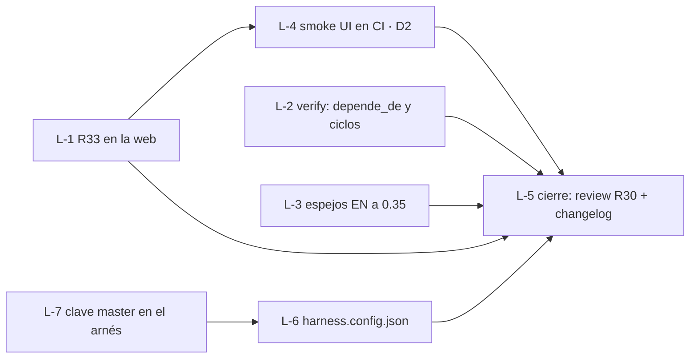

# Loop dev-de-10

Primer loop con contrato del paquete (R33, `loops.md`). Tipo **calidad**: dejar el desarrollo local «de 10» antes de pensar en producción. Pedido del owner el 2026-10-06.

## Disparador
A pedido del owner (2026-10-06), una vez aprobado este archivo.

## Objetivo (medible)
1. `node --test "web/tests/*.test.mjs"` → `fail 0`. Hoy, 2026-10-06 sobre 83e798f + MD de 0.35: **47/49**; los 2 rojos son R33, que todavía no está en la web (sincronía de reglas y conteos), y son los esperados.
2. `python -m unittest discover -s harness/tests` → `OK`, con tests nuevos de que `verify.py` marca un `depende_de` que no existe y un ciclo (cada uno visto en rojo primero, R29).
3. `node --test "dev/tests/*.test.mjs"` → `fail 0` (entorno local con Postgres levantado).
4. **D2 cerrada:** el smoke de la interfaz por CDP vive en el repo, corre en `.github/workflows/web.yml` y está verde; `status.md` la tacha con fecha.
5. **Espejos en inglés al día:** `SDD-MASTER-EN.md` y `SDD-COMPACT-EN.md` dicen 0.35 y no les falta ninguna regla ni fila del §2 del canónico (hoy el master en inglés quedó en 0.30).
6. Cero drift: `python harness/verify.py --quick` en verde y ningún `DRIFT` abierto.

## Grafo de tarjetas

L-1, L-2, L-3 y L-6 están listas de entrada (zonas distintas: `web/`, `harness/`, `*-EN.md`, `harness.config.json`); van de a 3 en paralelo, cada una en su rama `v0.35-L-<n>` y su worktree. L-6 apareció en la vuelta 0: este repo no tenía `harness.config.json`, así que el objetivo 6 no se podía medir. Tarjetas en `sdd/cards/`; L-5 la hace el leader. L-7 nació del DRIFT de L-6 (opción A del owner, 2026-10-06): el arnés tenía fija la ruta `sdd/SDD-MASTER.md`.

## Verificación
Los seis comandos o chequeos de arriba, @ el hash de la rama. Al final, un reviewer independiente los re-ejecuta (R30) y escribe `sdd/progress/v0.35-loops-grafo/review_dev-de-10.md`.

## Reglas de corte (la primera que salte)
- Los seis cumplidos y review `APPROVED` → `cumplido`.
- Tope: **8 vueltas** (vuelta = tarjeta cerrada o bloqueada).
- La misma firma de falla 2 veces seguidas → escalar al owner.
- Hace falta cambiar un objetivo, un requisito o una decisión → `DRIFT` (R25) y esperar.
- Hace falta push, merge a `main`, Supabase o Vercel → frenar y pedir OK (R01, R32).
- Hace falta una dependencia nueva (por ejemplo, para el smoke) → línea en `decisions.md` (R28) y OK.

## Memoria
- Bitácora: `sdd/progress/v0.35-loops-grafo/current.md`, una línea por vuelta.
- Al cortar: resumen abajo y HANDBACK al owner.

## Después de este loop
Fuera del alcance de este loop, en el orden que eligió el owner: v0.36 Obsidian (repo como vault y vault «Cerebro») con RAG local primero y OpenAI después, cada uno con su fase de MD; v0.37 un ejemplo de punta a punta; y recién ahí producción.

## Resumen al cortar
(vacío)
