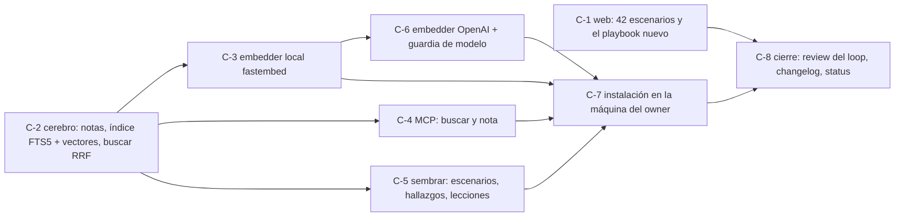

# Loop obsidian-cerebro

Loop de **feature** (R33, `loops.md`): implementar `playbooks/obsidian-cerebro.md` (S41) y dejarlo andando en la máquina del owner. Pedido del owner el 2026-10-06 (RAG local primero, OpenAI después; los dos vaults; Cerebro en `Documents\Cerebro`).

## Disparador
A pedido del owner, una vez aprobado este archivo.

## Objetivo (medible)
1. `node --test "web/tests/*.test.mjs"` → `fail 0` (hoy 48/49: el conteo de escenarios de la web dice 40 y son 42).
2. `python -m unittest discover -s cerebro/tests` → `OK`, sin red ni modelos (embedder falso), y en CI (`.github/workflows/cerebro.yml`, Windows + Ubuntu).
3. Búsqueda que sirve, sobre el Cerebro sembrado con lo real del paquete: `python cerebro/cerebro.py buscar "el loop no sabe cuándo frenar"` trae la nota de S39 entre las 3 primeras, y `buscar "copió un archivo para que pase el check"` trae la de S42 entre las 3 primeras, con embeddings **locales**.
4. MCP: `claude mcp list` muestra `cerebro` conectado, y una llamada a `buscar` desde Claude Code devuelve resultados con su `fuente`.
5. OpenAI: con `CEREBRO_EMBEDDINGS=openai` y la clave del owner en `.env`, `indexar --todo` + las dos búsquedas del objetivo 3 dan el mismo top 3 o mejor; sin la clave, el modo OpenAI falla con un mensaje claro y el local sigue andando.
6. `python harness/verify.py --quick` en verde, sin `DRIFT` abierto, y el repo se abre en Obsidian con el grafo conectado (lo confirma el owner con una captura o un «sí»).

## Grafo de tarjetas

C-1 y C-2 van en paralelo de entrada; después C-3, C-4 y C-5 (tope 3). Cada tarjeta en su rama `v0.36-C-<n>` y su worktree. **Ninguna tarjeta en tier ECONÓMICO** (S42): C-2, C-4 y C-6 tocan rutas, escritura en disco o una API paga.

## Verificación
Los seis objetivos de arriba @ el hash de la rama; al final, un reviewer independiente los re-ejecuta (R30) en `sdd/progress/v0.36-obsidian-cerebro/review_obsidian-cerebro.md`.

## Reglas de corte (la primera que salte)
- Los seis cumplidos y review `APPROVED` → `cumplido`.
- Tope: **10 vueltas** (vuelta = tarjeta cerrada o bloqueada).
- Misma firma de falla 2 veces seguidas → escalar al owner.
- Cambiar un objetivo, el contrato del playbook o una decisión → `DRIFT` (R25).
- **Frenar y pedir OK** antes de: instalar paquetes en el Python del owner (`pip install`), registrar el MCP en Claude Code (`claude mcp add` cambia su config), la primera llamada paga a OpenAI, push y merge (R01, R32).
- Dependencia nueva fuera de `fastembed`, `mcp` y `openai` → R28 y OK.

## Memoria
- Bitácora: `sdd/progress/v0.36-obsidian-cerebro/current.md`, una línea por vuelta.
- Al cortar: resumen abajo, HANDBACK al owner y —ahora que existe— una nota por lección en el Cerebro.

## Resumen al cortar
(vacío)
