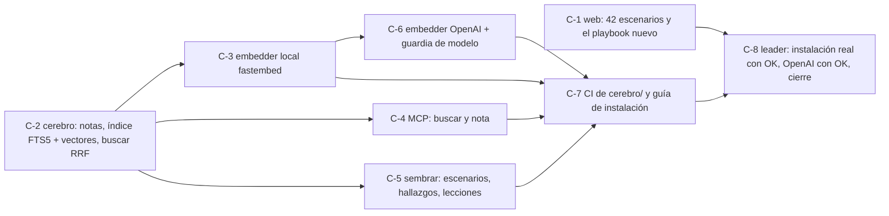

# Loop obsidian-cerebro

Loop de **feature** (R33, `loops.md`): implementar `playbooks/obsidian-cerebro.md` (S41) y dejarlo andando en la máquina del owner. Pedido del owner el 2026-10-06 (RAG local primero, OpenAI después; los dos vaults; Cerebro en `Documents\Cerebro`).

## Disparador
A pedido del owner, una vez aprobado este archivo.

## Objetivo (medible)
1. `node --test "web/tests/*.test.mjs"` → `fail 0` (hoy 48/49: el conteo de escenarios de la web dice 40 y son 42).
2. `python -m unittest discover -s cerebro/tests` → `OK`, sin red ni modelos (embedder falso), y en CI (`.github/workflows/cerebro.yml`, Windows + Ubuntu).
3. Búsqueda que sirve, sobre el Cerebro sembrado con lo real del paquete y con embeddings **locales** (MiniLM): para S39 y para S42, cada una con sus 5 consultas fijas, la nota queda entre las 5 primeras en al menos 3 de las 5 (`buscar "<consulta>" -k 5`). Las consultas se fijaron el 2026-10-06 antes de medir y no se cambian para que pase:
   - S39: «el loop no sabe cuándo frenar» · «el loop sigue sin criterio de corte» · «el agente no sabe cuándo parar de iterar» · «seguir iterando sin una condición de fin» · «no hay un criterio para terminar el ciclo de mejoras»
   - S42: «copió un archivo para que pase el check» · «el agente tocó archivos para que el chequeo dé verde» · «copiaron un archivo para que el test pase» · «hizo trampa copiando archivos para pasar la verificación» · «duplicó un archivo para que la validación no falle»
   _DRIFT (R25), 2026-10-06, decidido por el owner: el objetivo original medía una frase por escenario; con MiniLM S42 quedaba 10.ª, y mpnet (C-9) la metía 3.ª solo con esa frase exacta y empeoraba S39 con paráfrasis. Se vuelve a MiniLM y se mide un conjunto._
4. MCP: `claude mcp list` muestra `cerebro` conectado, y una llamada a `buscar` desde Claude Code devuelve resultados con su `fuente`.
5. OpenAI: con `CEREBRO_EMBEDDINGS=openai` y la clave del owner en `.env`, `indexar --todo` + las dos búsquedas del objetivo 3 dan el mismo top 3 o mejor; sin la clave, el modo OpenAI falla con un mensaje claro y el local sigue andando.
6. `python harness/verify.py --quick` en verde, sin `DRIFT` abierto, y el repo se abre en Obsidian con el grafo conectado (lo confirma el owner con una captura o un «sí»).

## Grafo de tarjetas

Tarjetas en `sdd/cards/C-*.md`; C-8 la hace el leader (instalar en la máquina del owner, registrar el MCP y la primera llamada a OpenAI llevan cada una su OK). C-1 y C-2 van en paralelo de entrada; después C-3, C-4 y C-5 (tope 3). Cada tarjeta en su rama `v0.36-C-<n>` y su worktree. **Ninguna tarjeta en tier ECONÓMICO** (S42): C-2, C-4 y C-6 tocan rutas, escritura en disco o una API paga.

## Verificación
Los seis objetivos de arriba @ el hash de la rama; al final, un reviewer independiente los re-ejecuta (R30) en `sdd/progress/v0.36-obsidian-cerebro/review_obsidian-cerebro.md`.

## Reglas de corte (la primera que salte)
- Los seis cumplidos y review `APPROVED` → `cumplido`.
- Tope: **10 vueltas** (vuelta = tarjeta cerrada o bloqueada).
- Misma firma de falla 2 veces seguidas → escalar al owner.
- Cambiar un objetivo, el contrato del playbook o una decisión → `DRIFT` (R25).
- **Frenar y pedir OK** antes de: instalar paquetes en el Python del owner (`pip install`), registrar el MCP en Claude Code (`claude mcp add` cambia su config), la primera llamada paga a OpenAI, push y merge (R01, R32).
- Dependencia nueva fuera de `fastembed`, `mcp` y `openai` → R28 y OK.

## Memoria
- Bitácora: `sdd/progress/v0.36-obsidian-cerebro/current.md`, una línea por vuelta.
- Al cortar: resumen abajo, HANDBACK al owner y —ahora que existe— una nota por lección en el Cerebro.

## Resumen al cortar
**Cortado el 2026-10-06** por tope: 10 de 10 vueltas; review del loop APPROVED @ aba801a (`sdd/progress/v0.36-obsidian-cerebro/review_obsidian-cerebro.md`), que recomienda `cortado` y no `cumplido`.

| Objetivo | Al cortar |
|---|---|
| 1 · `web/tests` | 74/74, smoke PASS (base: 48/49) |
| 2 · `cerebro/tests` | 219 OK (venv, sin modelo y sistema); `cerebro.yml` verde en GitHub (ubuntu/windows × 3.10/3.14) |
| 3 · búsqueda (5 consultas fijas por escenario, MiniLM) | **No cumplido, con deuda (decisión del owner):** S39 5/5 en el top 5; S42 0/5 (con OpenAI 1/5) |
| 4 · MCP | `cerebro` conectado con alcance de usuario; `buscar` desde Claude Code devuelve resultados con `fuente` |
| 5 · OpenAI | igual o mejor que local en el top 3 de las 10 consultas; sin clave, error claro y el local sigue |
| 6 · verify + grafo | `verify.py --quick` VERDE; **parcial (decisión del owner):** los 50 MD del núcleo forman un solo componente, pero el owner quiere todo el repo enlazado (`sdd/`, `skills/`, `imports/`…) |

- **Dos DRIFT, decididos por el owner:** el objetivo 3 medía una frase por escenario; cambiar a mpnet (C-9) la «pasaba» solo con esa frase y empeoraba S39 con paráfrasis → C-9 descartada y objetivo medido con un conjunto fijado antes.
- **Lo que atajaron los reviewers**, que los tests no veían: escritura fuera del Cerebro por un enlace (C-2, C-5), el aviso de descarga sin atar a stderr (C-3), la marca R26 rompible con separadores Unicode (C-4), un traceback con respuestas 200 malformadas (C-6), el instalador poniendo el Cerebro en OneDrive (C-7), tests borrados en silencio (C-3), el ZIP de la web rompiendo 74 links y después borrando notas del usuario (C-11).
- **Lección:** un objetivo de búsqueda con una sola frase se puede pasar sin mejorar nada; se mide con un conjunto de paráfrasis fijado antes y consultas de control.
- **Lección:** subagentes en paralelo comparten el scratchpad y pueden compartir worktree: el reviewer va en su propio worktree y cada agente con su subcarpeta; nunca `taskkill /IM`; en Windows `timeout` de cmd es `timeout.exe` y los mutantes salían «muertos» sin correr.
- **Lección:** una confirmación visual del owner se verifica con la captura; el primer «sí» del grafo no correspondía a lo que se veía.
- **Pendiente fuera del loop:** S42 del objetivo 3; enlazar el resto del repo (objetivo 6); re-importar el Cerebro real después de C-10 y no llevar links relativos a las notas (H4, H5 de la review); `cerebro/tests` en `verify.py --full`; merge a `main` con OK (el MCP apunta al checkout principal); decidir si se borra la rama `v0.36-C-9`.
