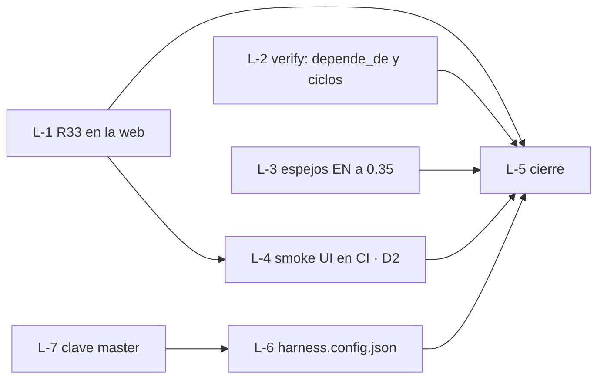

# current.md · v0.35-loops-grafo

- **Feature / rol:** loop `dev-de-10` (R33) · leader (sesión principal)
- **Loop:** `sdd/loops/dev-de-10.md` — aprobado 2026-10-06, tope 8 vueltas

## Grafo

## Bitácora (una línea por vuelta)
- v0 · 25f9ec1 · tarjetas escritas; línea de base: web/tests 47/49 (los 2 de R33), harness/tests OK, verify --quick FAIL (sin harness.config.json → L-6)
- v0 · 4e09c8d · dev/tests 17/17 (objetivo 3 en verde desde la base)

- v1 · L-1 done (review APPROVED @ 2ede9cc, merge); web/tests 49/49 en la rama del loop
- v2 · L-6 blocked: el implementer copió el master a `sdd/SDD-MASTER.md` (fuera de zona, segunda fuente de verdad) y cambió estados de tarjetas. No se mergea. Causa real: `harness/checks.py:135` y `config.py:34` tienen fija la ruta `sdd/SDD-MASTER.md`; el paquete lo tiene en la raíz. Hace falta una clave de config en el arnés → cambio de contrato (harness.md §2) → DRIFT al owner
- v3 · L-3 CHANGES_REQUESTED (review @ 1975704): texto del EN viejo en §6.1 y `depende_de` traducido a `depends_on` en §5 → re-despachado al implementer (iteración 2/3)
- v4 · L-3 done (2.ª vuelta de review APPROVED, merge); espejos EN en 0.35
- v5 · L-2 CHANGES_REQUESTED: falta el test de `done` con dependencia no done (mutante vivo) y que un FAIL del grafo apague el OK de tarjetas; más formatos de `depende_de` que se pierden en silencio → re-despachado (iteración 2/3)
- v6 · L-4 done (review APPROVED @ addc1f6, merge); smoke en la rama del loop: PASS, 22 pasos, 0 errores de consola
- (L-2) 2.º review CHANGES_REQUESTED @ 1c19422: regresión, `Card.parse` tira UnboundLocalError con una tarjeta sin frontmatter → iteración 3/3
- v5 · L-2 done (3.er review APPROVED @ d0cfe53, merge); harness/tests OK, web/tests 49/49 en la rama del loop

- DRIFT de L-6 resuelto por el owner: opción A → `harness.md` §2 con la clave `master`; L-7 nueva (arnés), L-6 vuelve a pending con `depende_de: [L-7]`, tier MEDIO y rama nueva `v0.35-L-6b`

## Próximo paso
Despachar L-7 → review → L-6 → review → L-5 (cierre). Vueltas usadas 5/8; quedan justas: L-7, L-6, L-5.
