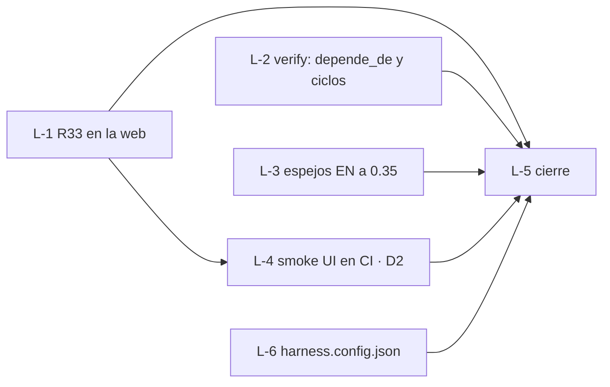

# current.md · v0.35-loops-grafo

- **Feature / rol:** loop `dev-de-10` (R33) · leader (sesión principal)
- **Loop:** `sdd/loops/dev-de-10.md` — aprobado 2026-10-06, tope 8 vueltas

## Grafo

## Bitácora (una línea por vuelta)
- v0 · 25f9ec1 · tarjetas escritas; línea de base: web/tests 47/49 (los 2 de R33), harness/tests OK, verify --quick FAIL (sin harness.config.json → L-6)

## Próximo paso
Despachar L-1, L-2 y L-6 en paralelo (worktrees `../sdd-universal-L-<n>`); L-3 cuando se libere un lugar.
