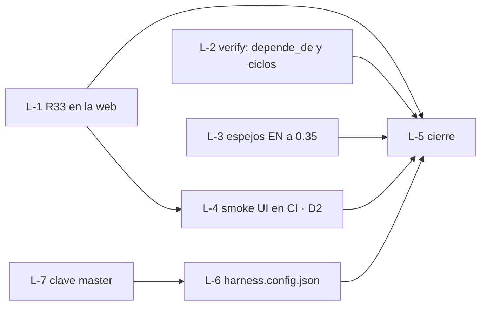

# current.md · v0.35-loops-grafo

- **Feature / rol:** loop `dev-de-10` (R33) · leader (sesión principal)
- **Loop:** `sdd/loops/dev-de-10.md` — aprobado 2026-10-06, tope 8 vueltas

## Grafo

## Bitácora (vuelta = tarjeta cerrada o bloqueada, `loops.md` §3)
- base · 25f9ec1 · web/tests 47/49 (los 2 de R33), harness/tests OK, verify --quick ROJO (sin config → L-6); 4e09c8d · dev/tests 17/17
- v1 · L-1 done (review APPROVED @ 2ede9cc); web/tests 49/49
- v2 · L-6 blocked: copió el master a `sdd/` y cambió estados de tarjetas (fuera de zona). Causa: ruta del master fija en el arnés → DRIFT al owner
- v3 · L-3 done (1.er review CHANGES_REQUESTED: texto del EN viejo y `depends_on`; 2.º APPROVED @ 88edd90)
- v4 · L-4 done (APPROVED @ addc1f6); smoke PASS, 22 pasos
- v5 · L-2 done (CHANGES_REQUESTED ×2: mutantes vivos, después UnboundLocalError; APPROVED @ d0cfe53)
- DRIFT de L-6 → opción A del owner: clave `master` en `harness.md` §2; L-7 nueva
- v6 · L-7 done (CHANGES_REQUESTED: M7/M9/M10 vivos; APPROVED @ 2840dd0)
- v7 · L-6 done (1.ª vuelta blocked bien dado por citas a rutas de un proyecto normal, que el leader corrigió; APPROVED @ b0c8bbb); verify --quick VERDE 0/0
- v8 · L-5 cierre: changelog 0.35.0, status (F26, D2 cerrada), testing.md; review del loop

## Próximo paso
Review independiente del loop (R30) → `review_dev-de-10.md`. Con APPROVED: loop `cumplido` y HANDBACK al owner pidiendo OK para push y merge.
